Al trabajar a través de las lecciones de este curso, usted ha aprendido las habilidades y conocimientos necesarios para crear un sitio web en Django mediante la creación de un proyecto y una aplicación.

Se le han proporcionado fragmentos de código y se le ha encomendado la tarea de utilizarlos, más su propio código, para crear un sitio web que muestre las páginas del menú del restaurante Little Lemon.

Los usuarios visitan la página principal y pueden navegar a las páginas Acerca de, Menú y Reservar utilizando el menú principal. 

La página del menú contiene una lista de los elementos del menú que están almacenados en la base de datos. Cada elemento del menú se ha añadido utilizando la interfaz de usuario de administración de Django y contiene la siguiente información:

- Nombre
- Precio
- Descripción
- Imagen

Cada elemento del menú contiene un enlace que muestra una página dedicada al elemento individual.

Ahora participará en un ejercicio de revisión por pares en el que presentará su proyecto terminado para que dos de sus compañeros lo revisen. También deberá revisar el proyecto de dos de sus compañeros.

Los criterios de calificación se tratan con más detalle a continuación.

Cuando envíe su tarea, otros alumnos del curso revisarán y calificarán su trabajo. Evaluarán lo siguiente:

- ¿Tiene la página de inicio un enlace que cargue la página del menú?

- ¿Contiene la página del menú una lista de los elementos del menú?

- ¿Se muestran los elementos del menú en orden alfabético?

- ¿Se muestran los elementos del menú con su precio asociado?

¿Se puede hacer clic en los elementos del menú para navegar a la página de elementos del menú?

- ¿Presenta la página del menú toda la información sobre el mismo?

- ¿Contiene la página web una sección de pie de página

Aquí tiene algunos ejemplos que le ayudarán a entender cómo debe ser su tarea.

http://127.0.0.1:8000/menu/

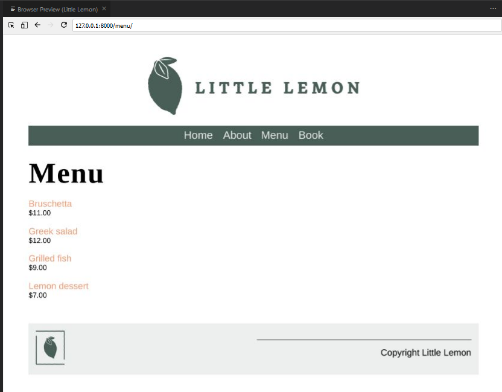

página de menú de little Lemon
http://127.0.0.1:8000/menu_item/1/

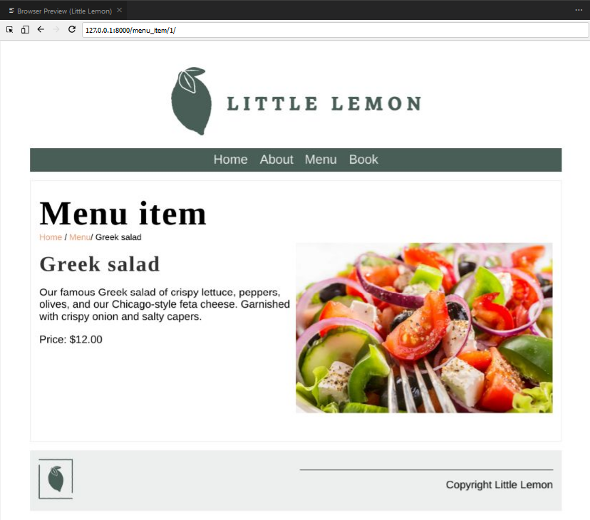

página del menú de revisión por pares
Nota: El id se asigna automáticamente a cada elemento del menú en orden incremental a medida que los añade utilizando Django admin.

Su proyecto se construirá utilizando el editor VS Code dentro del laboratorio de Coursera.  Cuando esté satisfecho de que el código funciona y haya probado el proyecto en el navegador, deberá realizar los siguientes pasos para exportar el proyecto a su máquina local.  

Exportar proyecto Django  

Paso 1:

Seleccione el enlace de archivos de laboratorio en la parte superior del laboratorio.

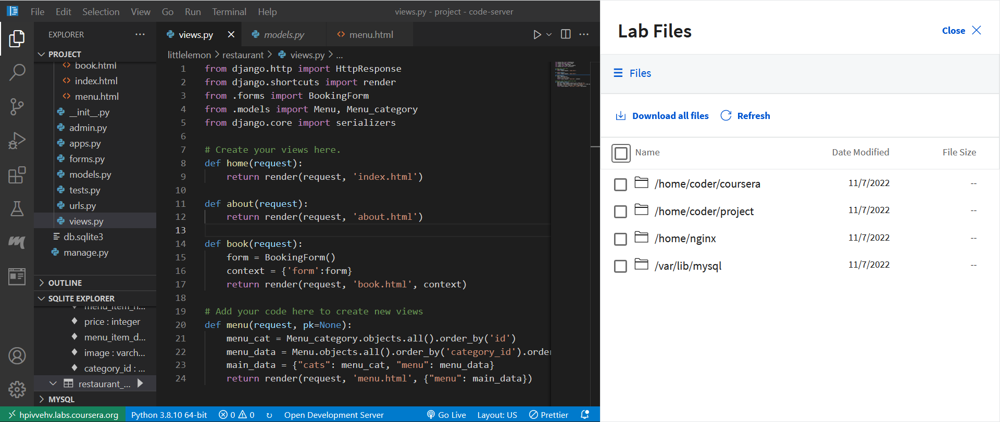

Visualización de archivos de laboratorio

Paso 2:

Mediante la casilla de verificación, seleccione todos los archivos de laboratorio.

Consejo: Para seleccionar todos los labs a la vez, haga clic en la casilla de verificación junto a la palabra Nombre

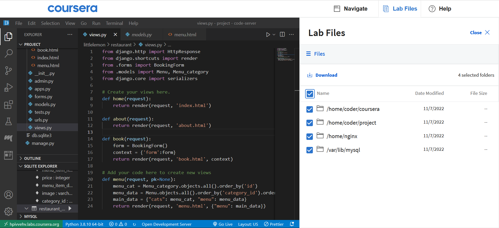

Visualización de archivos de laboratorio
Paso 3:

Haga clic en el enlace de descarga para descargar todos los archivos. Tenga en cuenta que los archivos se descargarán en formato .zip

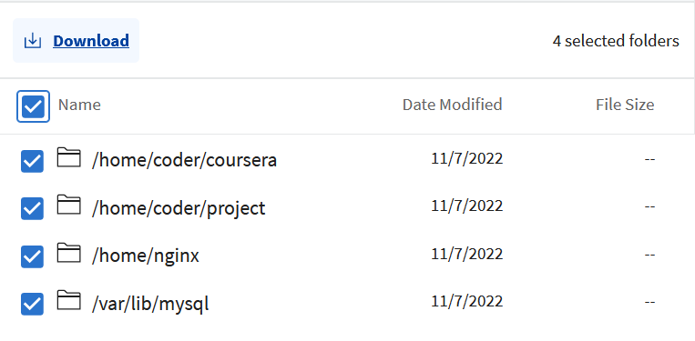

Visualización de carpetas para descargar
Paso 4:

Una vez que el archivo .zip se haya descargado en su máquina local, deberá extraerlo.

Para saber más sobre cómo comprimir y descomprimir carpetas visite la página 
Mac
 o 
Windows
 página de soporte.

Una vez extraído el archivo zip localice la carpeta littlelemon en la siguiente ruta:

Archivos > Archivos > inicio > coder > proyecto

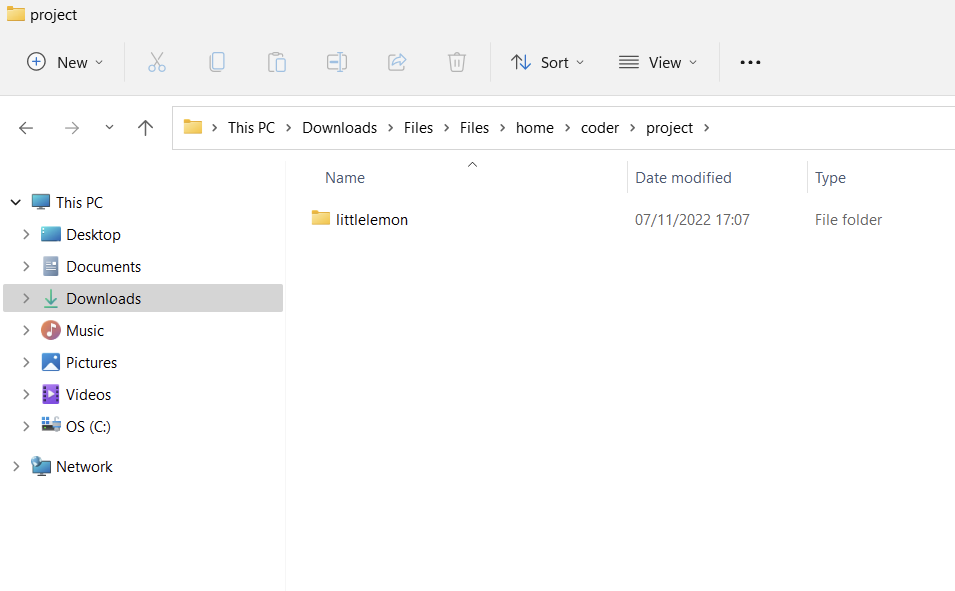

Visualización del directorio de la ruta del proyecto
La carpeta llamada littlelemon es la carpeta de su proyecto. Ahora debe comprimir esta carpeta para poder subirla a la plataforma Coursera.

Paso 5:

Comprima la carpeta del proyecto littlelemon. Para saber más sobre cómo comprimir y descomprimir carpetas visite la página de 
Mac
 o 
Windows
 página de soporte.

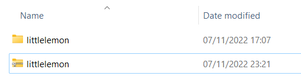

Carpeta del proyecto Little lemon comprimida
Una vez que haya creado la carpeta littlelemon en formato .zip, estará listo para subir el proyecto para la revisión por pares.

Subir proyecto Django para revisión por pares
Suba la carpeta littlelemon .zip. Sus revisores la descargarán y la subirán al laboratorio sandbox y seguirán las instrucciones proporcionadas para probar el código. El resultado de sus interacciones con su aplicación mostrará si se ha implementado la funcionalidad requerida.

Paso 1:

Abra la lección 
Tarea evaluada por pares: Rúbrica de revisión por pares: Diseñar y construir una aplicación Django sencilla 

Paso 2:

Haga clic en la pestaña Mi envío y rellene el campo del Título del proyecto. Puede utilizar el código de codificador único que se le asignó en el laboratorio, por ejemplo coder@83f6c42e40ee.

A continuación, haga clic en el botón Cargar archivo.

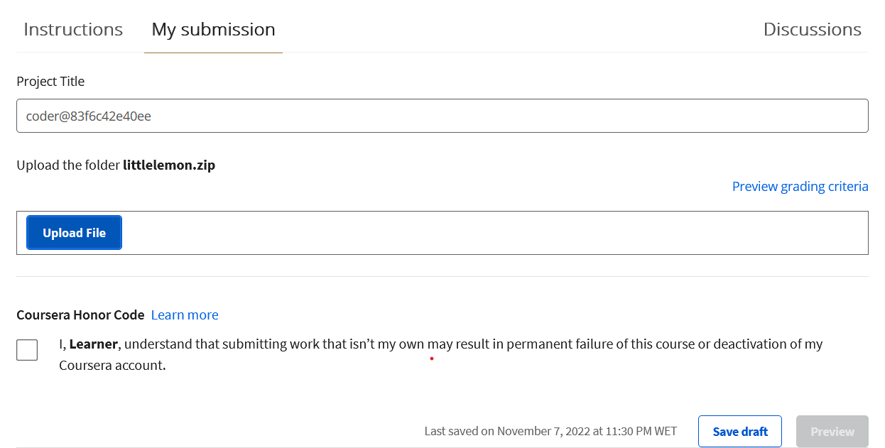

Mi ficha de presentación en la vista previa del proyecto
Localice el archivo littlelemon.zip y cárguelo. Haga clic en la casilla Código de honor de Coursera y, a continuación, en el botón Vista previa. Para terminar, haga clic en el botón Enviar.

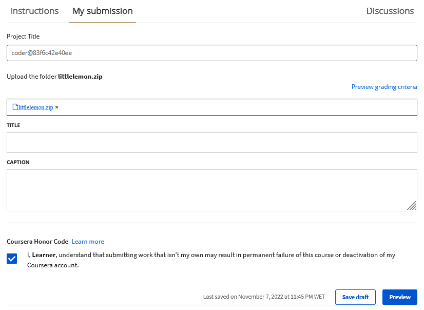

Mi ficha de presentación en la vista previa del proyecto

Una vez que haya enviado su proyecto Django, deberá revisar los envíos de dos de sus compañeros. Puede ver los compañeros que debe revisar en la sección "Compañeros a revisar".

Los pasos son los siguientes.

Descargue el proyecto Django de su par

Paso 1:

Haga clic en el botón Revisar asignaciones 

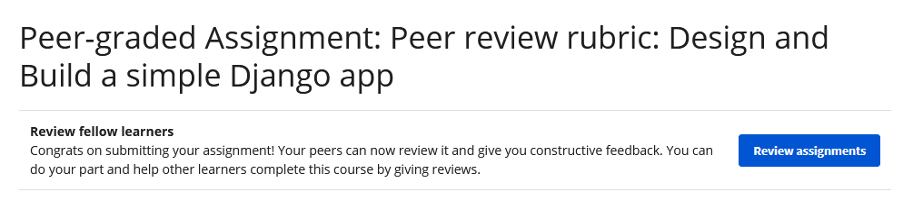

Captura de pantalla de una tarea calificada por compañeros

Paso 2: 

Lea las instrucciones bajo el título Revisar compañeros y pulse el botón Empezar a revisar.

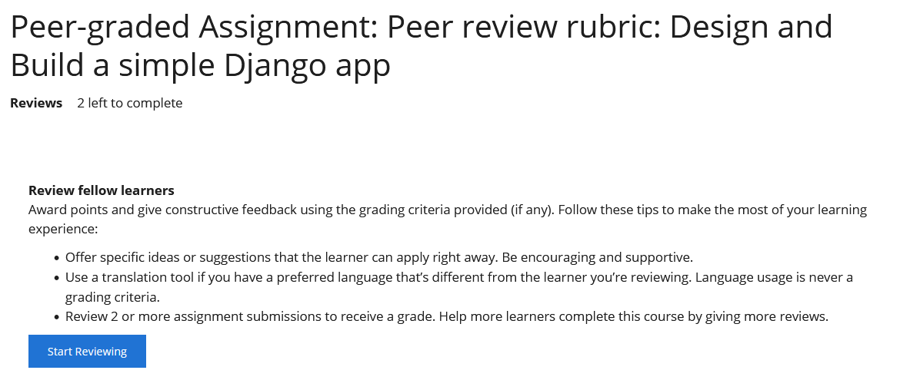

Botón de inicio de revisión por pares
Descargue el proyecto de su compañero a su máquina local utilizando el enlace proporcionado.

Nota: La carpeta del proyecto estará en formato .zip.

Suba el proyecto Django de su compañero al laboratorio sandbox

Paso 1:

Abra el sandbox de revisión
 por pares y siga las instrucciones.

Paso 2:

Suba el proyecto Django siguiendo las instrucciones del sandbox Peer review.

Paso 3:

Ejecute el servidor de desarrollo y abra el proyecto en el navegador en la URL http://127.0.0.1:8000/

Paso 4:

Abra una nueva pestaña en su navegador y abra la página de revisión por pares. Revise la página y responda a las preguntas.

Como revisor, deberá proporcionar comentarios sobre las tareas enviadas por dos de sus compañeros.

Sus comentarios deberán centrarse en la funcionalidad de la aplicación.

Siga las instrucciones y busque el resultado esperado. Si observa algún error en la funcionalidad de alguno de sus elementos, tendrá la oportunidad de orientar a sus compañeros sobre cómo podrían solucionar el error.

Un ejemplo de buena retroalimentación sería

El proyecto contenía todas las acciones esperadas. Sin embargo, en la página del menú, el elemento del menú no se mostraba como hipervínculo. Le sugeriría que revisara el código para crear el hiperenlace.

